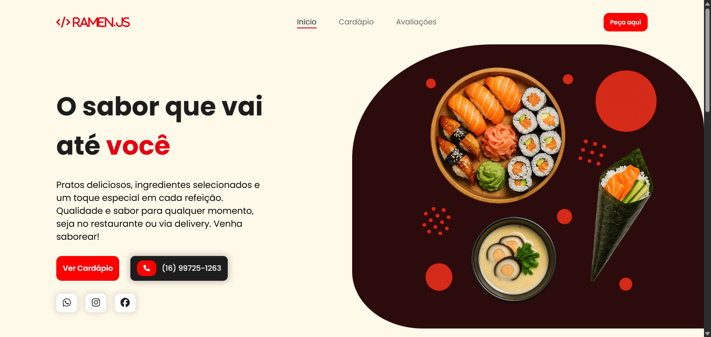

# 🍜 Ramen.Js - Landing Page

## Sobre o projeto

O **Ramen.Js** é uma landing page criada para um restaurante fictício de comida japonesa voltado para devs.  
Este projeto foi desenvolvido com o objetivo de praticar estilização e estudos de **jQuery**.

## Funcionalidades

- Layout totalmente responsivo 📱💻
- Efeitos de transição entre seções no header
- Animações de entrada com **ScrollReveal**

> Obs.: Esta landing page é apenas visual, sem funcionalidades de back-end ou pedidos.

## Tecnologias utilizadas

- HTML5
- CSS3
- jQuery
- ScrollReveal.js
